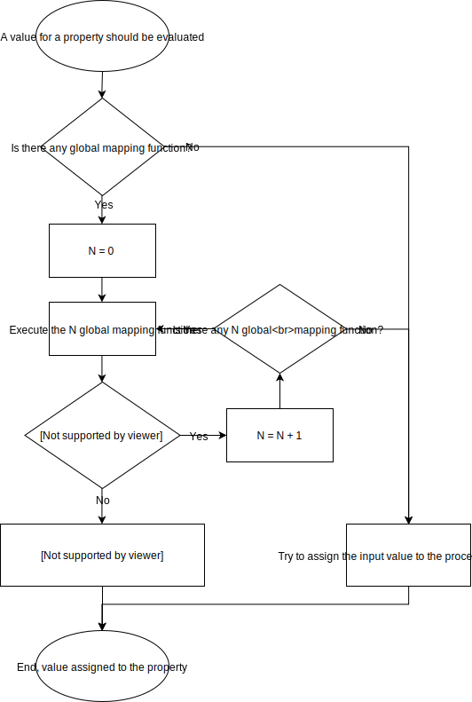

<p></p>


[](https://www.nuget.org/packages/SimplePatch/) [](LICENSE)

A simple library for partial entity changes in ASP.NET and ASP.NET Core.

[SimplePatch **v1.x** documentation](README-v1.x.md)

## Summary
- [Quick Start](#quick-start)
- [Introduction](#introduction)
- [Install](#install)
- [How to use](#how-to-use)
- [Configuration](#configuration)
   - [Globals](#globals)
     - [Adding entities](#--adding-entities)  
     - [Ignore letter case for property names](#--ignore-letter-case-for-property-names)
     - [(Global) Mapping functions](#--global-mapping-functions)
   - [Properties Configuration](#properties-configuration)
     - [Exclude properties](#--exclude-properties)
     - [Ignore null value](#--ignore-null-value)
     - [Mapping functions](#--mapping-functions)

## Quick Start
```
PM> Install-Package SimplePatch
```
Jump to [How to use](#how-to-use).


## Introduction

### The problem
Partial modification of entities is one of the common issues when implementing a RESTful service in ASP.NET Web API. The client, in fact, must specify the value for all entity properties, including those properties whose value has not been changed. Typically, to solve this problem, you use these solutions with their own problems:
- [`Delta<T>`](https://msdn.microsoft.com/en-us/library/jj890572(v=vs.118).aspx) (part of Microsoft ASP.NET WebAPI OData): it has some problems with numbers when using JSON (see [this answer](https://stackoverflow.com/a/14734273/7772490)). You also need to install the package with all its non-trivial dependencies;
- [JSON Patch](http://jsonpatch.com/): the client must organize the data per operation and the size of the request is not optimized.

##### Demonstrative example
The client must set the `Enabled` property of the `User` entity. The latter, however, also exposes the `Name` property. The client is forced to pass both the values of the `Enabled` and `Name` properties in the request body.

*Request body*
```   
{ "Enabled": true, "Name": "User1" }
```

In a real case, however, the properties of an entity are more than two, making the problem more pronounced.
```   
{ "Enabled": true, "Name": "User1", "Prop1": "Value1", "Prop2": "Value2", "Prop3": "Value3", ... }
```

### The solution
The ideal solution is to allow the client to make a request with the only properties to modify.
Returning to the example shown in the *[Problem](#the-problem)* section, the request body for changing the value of the `Enabled` property will be:
```   
{ "Enabled": true }
```
If the entity has more than one property, the request body will remain the same.

*SimplePatch* allows you to implement this solution in ASP.NET Web API and ASP.NET Core Web API.

## Install
Launch the following command from *Package Manager Console*:
```
PM> Install-Package SimplePatch
```

## How to use
See [*examples* folder](https://github.com/OmarMuscatello/SimplePatch/tree/master/examples) to learn how to use this library with ASP.NET and ASP.NET Core.

##### Add target entity
In your `Startup.cs` file or in the `Global.asax` file, add the entity/ies which you plan to use.
```
DeltaConfig.Init(cfg => {
    cfg.AddEntity<Person>();
});
```

##### Patching a single entity
```
[HttpPatch("{id}")]
public async Task<IActionResult> PatchOne(int id, Delta<Person> person)
{
    // Determines the entity to be updated according to the id parameter
    var personToPatch = await TestData.People.FirstOrDefault(x => x.Id == deskid);
    if (personToPatch == null) return BadRequest("Person not found");

    // Apply the changes specified to the original entity
    person.Patch(personToPatch);

    // Now the personToPatch variable is updated

    return Ok(personToPatch);
}
```
##### Patching multiple entities
```
[HttpPatch]
public async Task<IActionResult> PatchMultiple(DeltaCollection<Person> people)
{
    foreach (var person in people)
    {
        // Try to get the value of the Id property
        if (person.TryGetPropertyValue(nameof(Person.Id), out var id))
        {
            // Determines the entity to be updated according to the specified id
            var personToPatch = TestData.People.FirstOrDefault(x => x.Id == Convert.ToInt32(id));
            if (personToPatch == null) return BadRequest("Person not found (Id = " + id + ")");

            // Apply the specified changes to the original entity       
            person.Patch(personToPatch);
        }
        else
        {
            // The Id property was not specified for the person represented by the person variable 
            return BadRequest("Id property not found for a person");
        }
    }

    return Ok();
}
```
##### Patching a single entity (Entity Framework)
```
[HttpPatch]
public async Task<IActionResult> PatchOne(int id, Delta<PersonEF> person)
{
    // Determines the entity to be updated according to the id parameter
    var personToPatch = await db.People.FindAsync(id);
    if (personToPatch == null) return BadRequest("Person not found");

    // Apply the specified changes to the original entity     
    person.Patch(personToPatch);

    // Now the personToPatch variable is updated


    // Mark the entity as modified
    db.Entry(personToPatch).State = EntityState.Modified;

    // Save the changes
    await db.SaveChangesAsync();

    return Ok(personToPatch);
}
```

##### Patching multiple entities (Entity Framework)
```
[HttpPatch]
public async Task<IActionResult> PatchMultiple(DeltaCollection<PersonEF> people)
{
    foreach (var person in people)
    {
        // Try to get the value of the Id property
        if (person.TryGetPropertyValue(nameof(PersonEF.Id), out var id))
        {
            // Determines the entity to be updated according to the id parameter
            var personToPatch = await db.People.FindAsync(Convert.ToInt32(id));
            if (personToPatch == null) return BadRequest("Person not found (Id = " + id + ")");

            // Apply the specified changes to the original entity
            person.Patch(personToPatch);

            // Mark the entity as modified
            db.Entry(personToPatch).State = EntityState.Modified;
        }
        else
        {
            // The Id property was not specified for the person represented by the person variable 
            return BadRequest("Id property not found for a person");
        }
    }

    // Save the changes
    await db.SaveChangesAsync();

    return Ok();
}
```

## Configuration
All the configuration options can be specified through the `DeltaConfing.Init` function parameter. This function should be called at application startup, typically on the `Startup.cs` or `Global.asax` file.

For example:
```
public Startup(IConfiguration configuration)
{
    DeltaConfig.Init(cfg => {
        cfg.AddEntity<Person>()
            .Property(x => x.Id).Exclude();
    });
}
```

### Globals
#### - Adding entities
To be able to use an entity you must add it using the `AddEntity<T>` method of the configuration object.
```
DeltaConfig.Init(cfg =>
{
    cfg.AddEntity<Person>();
    cfg.AddEntity<Book>();
});
```

#### - Ignore letter case for property names
You can ignore letter case for property names. This is useful when you have different name conventions between client code and server code.

For example, the `name` property sent by the client wouldn't be detected as part of an entity which has a property named `Name` (note the first letter is **upper case**).

_Usage_
```
DeltaConfig.Init(cfg =>
{
    cfg.AddEntity<Person>();

    cfg.IgnoreLetterCase(); // <==
});
```

#### - (Global) Mapping functions
Mapping functions allow you to manipulate a value before it is assigned to the property.

You could use this feature to handle a specific type.

For example, let's say you want to handle a specific date format (dd/mm/yyyy) for a property whose type is `Nullable<DateTime>`. You could use a global mapping function like this:
```
DeltaConfig.Init(cfg =>
{
    cfg.AddEntity<Person>();

    cfg.AddMapping((propertyType, newValue) =>
    {
        var result = new MapResult<object>();

        if (propertyType != typeof(DateTime?) || newValue.GetType() != typeof(string))
        {
            // No action executed
            return result.SkipMap();
        }

        if (DateTime.TryParseExact((string)newValue, "dd/MM/yyyy", new CultureInfo("it-IT"), DateTimeStyles.None, out var date))
        {
            // Value which be assigned to the property
            result.Value = date;
        }
        else
        {
            // Value can be null because the target property is of type Nullable<DateTime>
            result.Value = null;
        }

        return result;
    });
});
```

You can add as many mapping function as you want. The result returned from the mapping function must be of type `MapResult<object>`.
The latter has a property named `Value` which stores the value which will be assigned to the property.

If the current mapping function shouldn't handle the property value, you can return the result of the `SkipMap()` method of the `MapResult<object>` instance.

To better understand how global mapping functions works, please take a look a the diagram below.



> **Remember**  You can assign assign `null` to the `Value` property of the returned `MapResult<object>` instance only if the target property is nullable. 

### Properties configuration
#### - Exclude properties
You can exclude one or more properties of an entity while applying the changes to the original entity to preserve the original value of the property. This might be useful for properties used to uniquely identify the entity.

**Global.asax** or **Startup.cs**
```
DeltaConfig.Init((cfg) =>
{
    // Exclude the Id property of the Person entity.
    cfg.AddEntity<Person>().Property(x => x.Id).Exclude();
});
```

**Note:** When a property is marked as *excluded* it will still be present in the `Delta<T>` object, but it will be ignored when  changes are applied (`Patch` method) to the original entity.


#### - Ignore null value
You can ignore null value for the specified property of an entity.

This is particularly useful in two cases:

- when your property is a value type (like `int` and `DateTime`) and your client still send a null value for that property. Ignoring null value will avoid exception.
- when your property is a reference type (which allows null) but you don't want that `null` overwrites your previous stored data.

**Global.asax** or **Startup.cs**
```
DeltaConfig.Init(cfg =>
{
    cfg.AddEntity<Person>().Property(x => x.MyProperty).IgnoreNull();
});
```

#### - Mapping functions
You can add property specific mapping functions to manipulate the input value before it is assigned to the specified property.
They works like [global mapping functions](%28global%29-mapping-functions) but they're applyed only for the specified property.

Let's say that the client send a two figures number as a string:
```
{
    "MyNumber": "52"
}
```
but, you want only the first figure of the number as a `int` (your property is of type `int`). You could use the following mapping function to handle the splitting and conversion:

**Global.asax** or **Startup.cs**
```
DeltaConfig.Init(cfg =>
{
    cfg.AddEntity<Person>().Property(x => x.MyNumber).AddMapping((propType, newValue) =>
    {
        var result = new MapResult<int>();

        // Ignore non string values
        if (newValue.GetType() != typeof(string)) return result.SkipMap();

        result.Value = Convert.ToInt32(newValue.ToString().Substring(0, 1));

        return result;
    });
});
```
To better understand what `SkipMap()` mean, please take a look at the [Global Mapping Functions diagram](#mapping-functions).

The result type of the specified function must be of the same type of the property for which the mapping function is added to.

#### Mapping functions order
In order to assign a value to a property, SimplePatch will evaluate the property mapping functions first. If there aren't property mapping functions or they return the result of `SkipMap()`, then the global mapping functions will be evaluated. If there aren't global mapping functions or they return the result of `SkipMap()`, then the default behavior will be used (SimplePatch will try to convert the input value type to the target property type).
